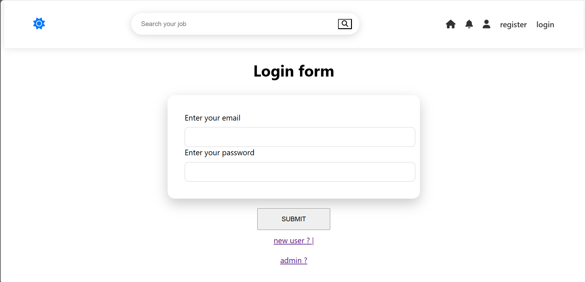
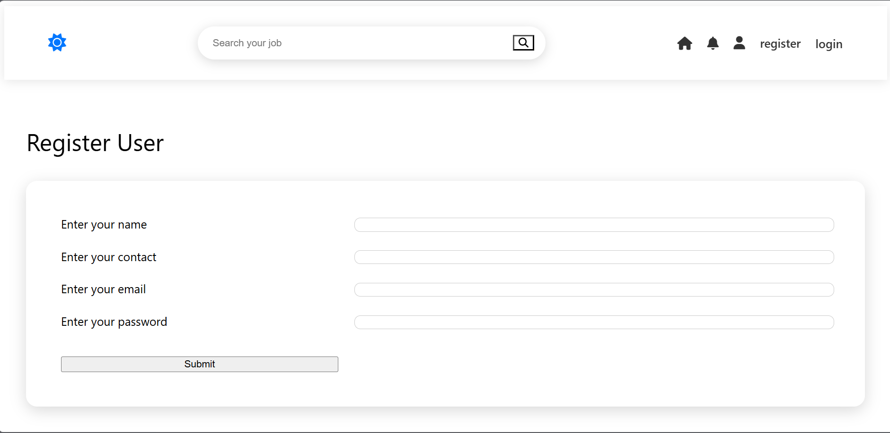
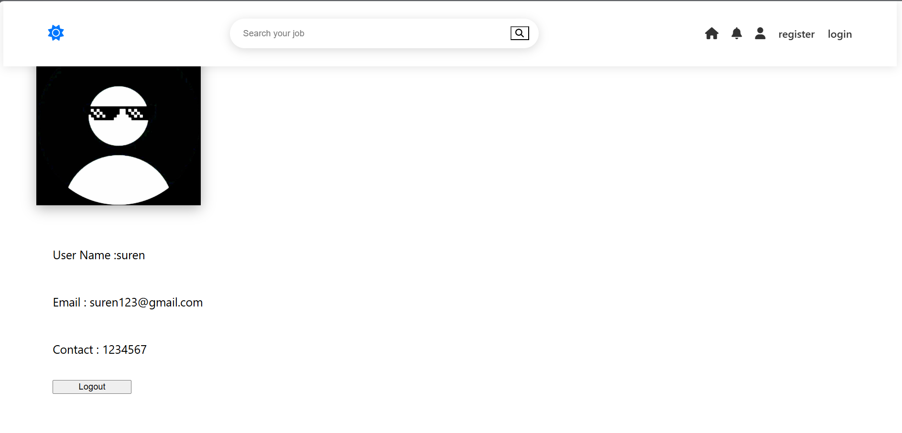

# Job Portal System

A full-stack job recruitment platform built using Java, Spring Boot, Hibernate, MySQL, HTML, CSS, and JavaScript that connects job seekers and recruiters through a centralized hiring system.

---

## Problem Statement

Job seekers often need to browse multiple websites to find suitable job opportunities, while recruiters require an efficient platform to manage job postings and candidate applications.

This process can be time-consuming, unorganized, and difficult to track.

The Job Portal System solves this problem by providing a centralized platform where users can register, search for jobs, apply online, and manage their profiles, while recruiters can post jobs and manage applicants from a single dashboard.

---

## Key Features

### User Management

* User Registration
* User Login
* Profile Management
* Secure Authentication

### Job Management

* Create Job Listings
* Update Job Details
* Delete Job Postings
* View Available Jobs

### Job Discovery

* Search Jobs by Keywords
* Browse Job Opportunities
* View Detailed Job Descriptions
* Explore Available Roles

### Application Management

* Apply for Jobs
* Track Job Applications
* Manage Applicant Information
* View Application Status

### Dashboard

* Admin Dashboard
* User Dashboard
* Job Management Panel
* Application Tracking System

---

## Tech Stack

### Backend

* Java
* Spring Boot
* Spring MVC
* Hibernate (JPA)
* REST APIs

### Frontend

* HTML5
* CSS3
* JavaScript

### Database

* MySQL

### Tools

* Git
* GitHub
* Maven
* Postman
* IntelliJ IDEA

---

## Architecture

Frontend Interface
↓
Spring MVC Controllers
↓
Service Layer
↓
Hibernate (JPA)
↓
MySQL Database
↓
REST APIs

---

## Screenshots

### Admin Login Page


### User Login Page



### Registration Page



### Job Roles Page


### User Profile Page



---

## Demo

### Application Walkthrough

> The demo showcases user registration, login, job searching, profile management, job applications, and recruiter/admin operations.

---

## What I Implemented

* Designed and developed a complete Spring Boot backend application
* Built RESTful APIs for user, job, and application management
* Implemented Hibernate JPA for database persistence
* Designed MySQL database schema and entity relationships
* Developed responsive frontend interfaces using HTML, CSS, and JavaScript
* Created user authentication and authorization workflows
* Implemented job posting and application management features
* Managed version control using Git and GitHub

---

## Technical Highlights

### Backend Development

* RESTful API development using Spring Boot
* Layered architecture implementation
* Service-based business logic
* MVC pattern implementation

### Database Design

* Entity relationship mapping using Hibernate
* User, Job, and Application management
* Structured relational database design
* Optimized data storage and retrieval

### Job Portal Functionality

* CRUD operations for job postings
* Job application workflow
* Profile management system
* Recruiter and candidate management

---

## Future Enhancements

* JWT Authentication
* Role-Based Access Control (RBAC)
* Resume Upload Feature
* Email Notifications
* Interview Scheduling System
* Job Recommendation Engine
* Cloud Deployment

---

## Installation

Clone the repository:

```bash
git clone https://github.com/Suren-IT/Job_Portal_FullStack.git
```

Navigate to the project:

```bash
cd Job_Portal_FullStack
```

Configure MySQL credentials in:

```properties
application.properties
```

Run the application:

```bash
mvn spring-boot:run
```

---

## Author

### Suren S

Java Full Stack Developer

GitHub:
https://github.com/Suren-IT

Linkedin:https://www.linkedin.com/in/suren-s-it

Email:
[ssuren2021@gmail.com](mailto:ssuren2021@gmail.com)

---

## Project Goal

This project was developed to demonstrate practical experience in Java backend development, Spring Boot application development, database management, authentication systems, CRUD operations, and full-stack web application development using industry-standard technologies.
